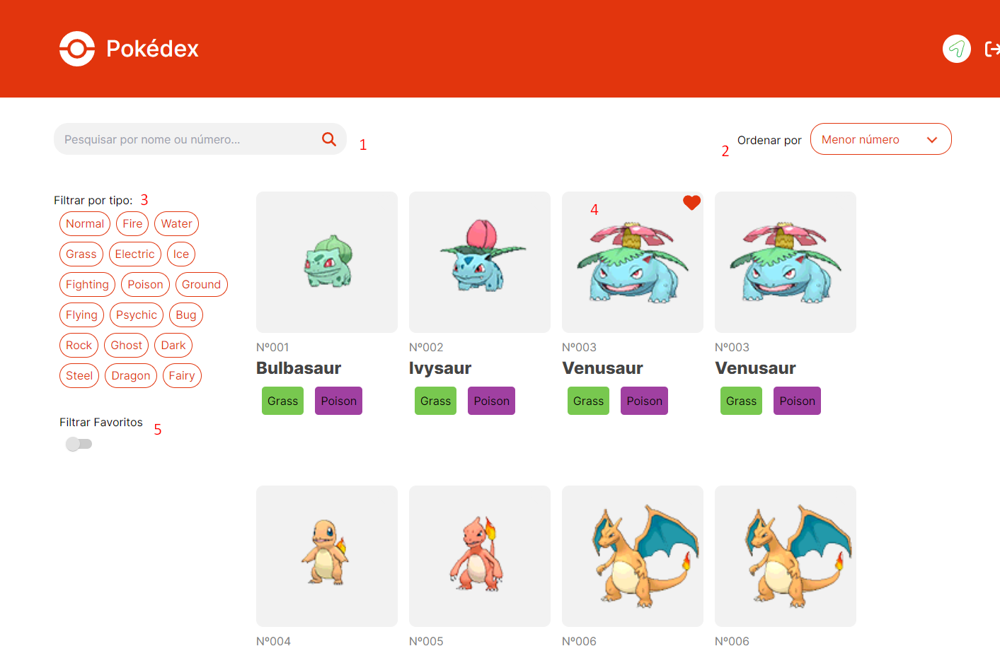

Olá! Me chamo João Sile e seja bem vindo a projeto Pokédex!

## Tecnologias Aplicadas

 - Next.js 14.0.4
 - React 18
 - TailwindCSS 3.3.0
 - Axios 1.6.5
 - Font Awesome 6.5.1
 - Material UI 5.15.5

A aplicação consome dados da API https://unpkg.com/pokemons@1.1.0/pokemons.json e tem como funcionalidade de estudo e entrevista apresentar habilidades no uso de tecnologias para listar, filtrar e favoritar Pokémons.
O deploy do site foi feito na ferramenta da [Vercel](https://vercel.com/) e pode ser acessado através da URL https://pokedex-nine-omega-24.vercel.app/.
Para rodar a aplicação localmente é necessária a versão mais atual do [Node.js](https://nodejs.org/en/download/current) e rodar os seguintes comandos dentro da pasta do projeto:
Para buildar caso necessário: 

    npm run build

Para inicializar:

    npm run dev

Feito isso basta acessar a seguinte URL no navegador de sua preferência:

     http://localhost:3000

Com sucesso você verá a seguinte tela:

São oferecidas as seguintes funcionalidades:
1 - Buscar Pokémons por nome ou número
2 - Ordenar por ordem crescente ou decrescente a listagem baseada em número
3 - Filtrar por tipos sendo possível escolher mais de um
4 - Definir Pokémons favoritos
5 - Listar apenas Pokémons favoritos